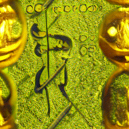

<h1 align="center">
Ganimate
</h1>
<h3 align="center">
A Gradio app for creating GAN animations
</h3>


StyleGAN3:
<p align="middle">
   
  
  
</p>

BigGAN:
<p align="middle">
  
  
   
</p>

## Installation
First, you will need `ffmpeg` (and `ffprobe`, which comes with it normally) installed and on path.

Clone the repo, including the submodules:
```
git clone --recurse-submodules https://github.com/zzbuzzard/Ganimate
cd Ganimate
```
Then install Real-ESRGAN (you should probably do this within a virtual env):
```
cd Real-ESRGAN
pip install -e .
```
and install the model from here: https://github.com/xinntao/Real-ESRGAN/releases/download/v0.1.0/RealESRGAN_x4plus.pth
. Put it in the `Ganimate/models` folder without changing the name.

Setting up StyleGAN3 is a bit weirder.
If on Windows, you will need Visual Studio installed,
and to run `"C:\Program Files (x86)\Microsoft Visual Studio\<VERSION>\Community\VC\Auxiliary\Build\vcvars64.bat"`
as well as put the MSVC compiler on your PATH (if it isn't already).
This is because they use CUDA extensions, it's a bit of a pain.
They have some Python reqs which I've included in my requirements.txt.
See the StyleGAN3 README for details, and if you have StyleGAN related issues.

Finally, install my requirements
```
cd ../
pip install -r requirements.txt
```

## Usage
Run `python main.py`, and wait for it to output a local URL.
Go to this URL in your browser, and you will be able to use the app!

<details>
<summary>App explanation</summary>

### GenObj Screen
<p align="center">
    
</p>
There are various settings shared between the models, such as batch size,
and optional upscaling / background removal. There are also
tiling options - TILE works by modifying convolutional layers,
and produces cool seamless results for BigGAN,
but does not work for StyleGAN. The mirror-based ones are less
cool but work for both.

Generate stuff with Generate, and it'll appear on the right.
Select the ones you like and press 'Save' - they'll go in the
(permanent) window on the left.

Choose between BigGAN and StyleGAN at the top.

#### BigGAN
Classes refers to ImageNet classes. Z-mul and C-mul multiply
the latent, leading to messed up (but kind of interesting) outputs like this:
<p align="left">
    
</p>

#### StyleGAN
W-mul and W-noise modify the intermediate latent in W space.
Z-mul isn't so important here, but W-mul will similarly produce
messed up / abstract images.
There are lots of models to choose from. Select one and press
generate, and it will automatically be downloaded to the `models` folder 
(they are around 300MB each).

### AnimObj Screen
<p align="center">
    
</p>
Here you can animate the 'objects' which you saved in the GenObj screen.
The correct GAN and settings for that object are automatically loaded,
so just set the animation parameters and click Animate, and it'll create a
video file.

### Anim Screen
<p align="center">
    
</p>
Finally, this screen is for producing interpolation animations from scratch.
Several latents are generated, and a loop formed between them, leading to a nice
seamless animation like this one:

<p align="left">
    
</p>
To save an animation, give it a name and click 'Save anim'.
The animations are saved in `anims/[name].mp4`

</details>

